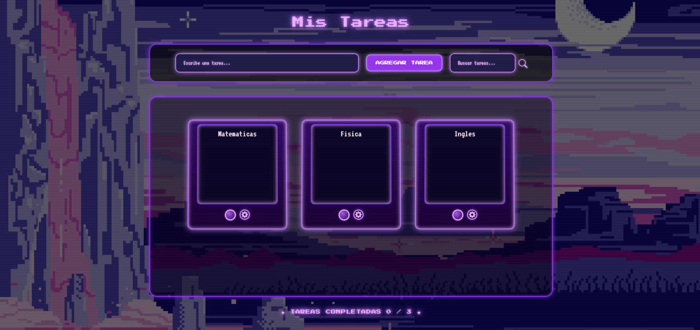

# 🎮 Lista de Tareas Arcade | Arcade Task Manager  
**Proyecto - GIT Institute Colombia | Project - GIT Institute Colombia**  
**Autora | Author: Daniela Coavas**

---

## 🌐 Vista en línea / Live Preview

➡️ [Haz clic aquí para ver el proyecto en acción](https://dannysophi17.github.io/Lista-de-Tareas-Arcade/)  
➡️ [Click here to see the project live](https://dannysophi17.github.io/Lista-de-Tareas-Arcade/)

---

## 📘 Español

### Descripción
Este es un proyecto web desarrollado como parte del curso en **GIT Institute Colombia**.  
Permite gestionar tareas con una estética retro estilo **arcade**, inspirada en videojuegos clásicos.

### 🧩 Funcionalidades
- Agregar, editar, eliminar y copiar tareas
- Buscar tareas con resaltado neón morado
- Contador animado de tareas completadas
- Diseño responsive y animaciones arcade
- Almacenamiento local en el navegador (localStorage)

### 🛠️ Tecnologías
- HTML5
- CSS3 con efectos neón
- JavaScript puro (Vanilla JS)
- Bootstrap 5 (para íconos y componentes)

### 📦 Uso
Abre el archivo `index.html` en tu navegador. No requiere instalación.

### 👾 Vista previa

---

## 📗 English

### Description
This is a web project developed as part of a course at **GIT Institute Colombia**.  
It allows you to manage tasks with a classic **retro arcade game** visual style.

### 🧩 Features
- Add, edit, delete, and copy tasks
- Search with neon-purple highlighting
- Animated completed-tasks counter
- Responsive design with retro game UI
- Local storage in browser (localStorage)

### 🛠️ Technologies
- HTML5
- CSS3 with neon effects
- Vanilla JavaScript
- Bootstrap 5 (icons and UI elements)

### 📦 Usage
Open the `index.html` file in your browser. No installation required.

### 👾 Preview

